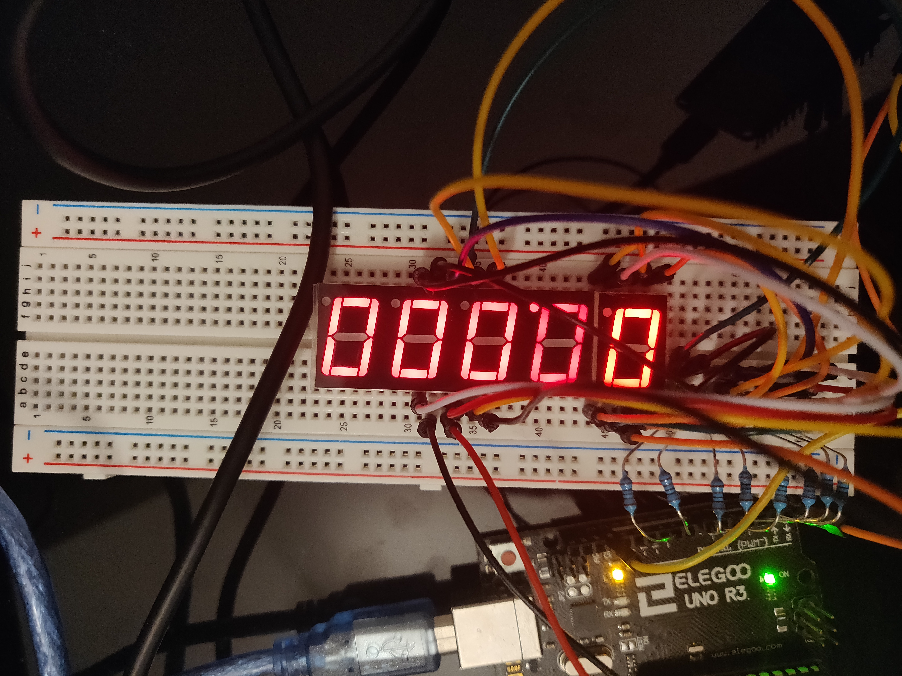
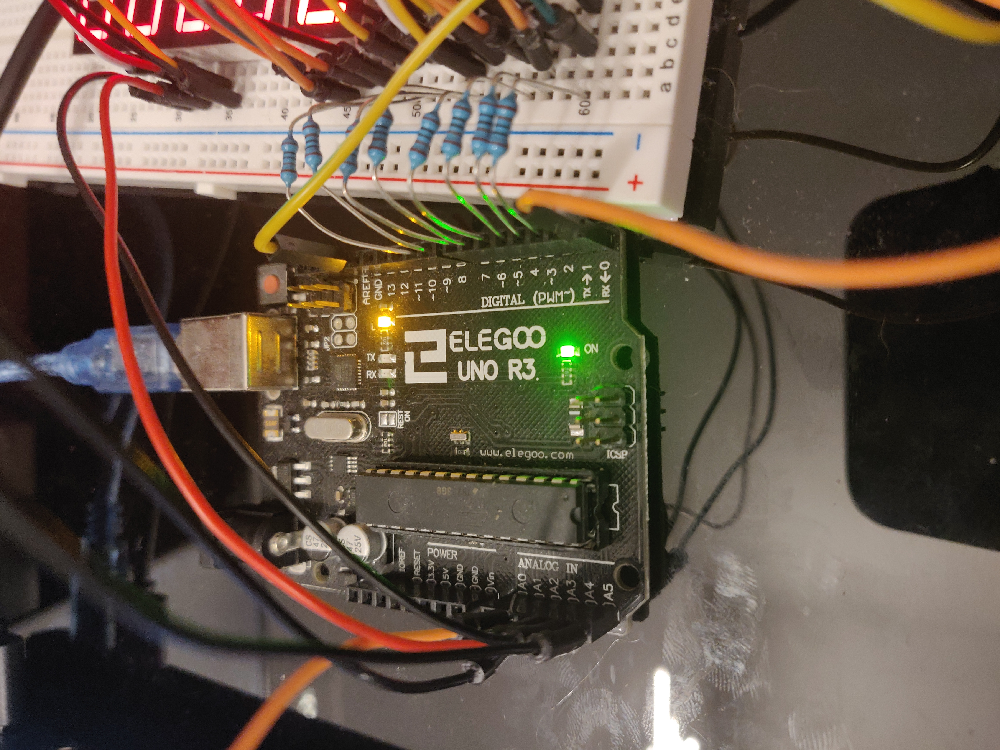

# Un compteur d'abonnés Instagram

Un petit compteur physique pour ses abonnés Instagram.

## Circuits

**L'afficheur 5x7 segments :**



**La carte Arduino Uno *(Elegoo)***




**La carte WiFi : l'ESP8266 - NodeMCU**


## Requête

Pour obtenir le nombre d'abonnés j'effectue une requête à l'addresse :

```
https://www.instagram.com/<username>/?__a=1
```

Le problème étant qu'au bout d'un certain nombre de requêtes, Instagram renvoie une page de connexion... Pour contrer ce problème, je récupère mon cookie de session sur mon navigateur puis le passe en paramètre de la requête.
Le nom du cookie de session sur Instagram est : `sessionid` !
